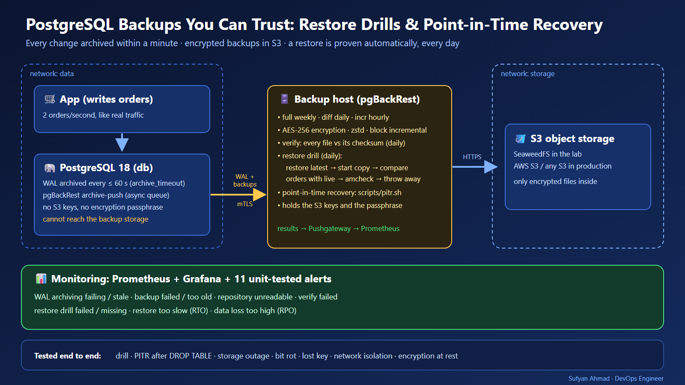
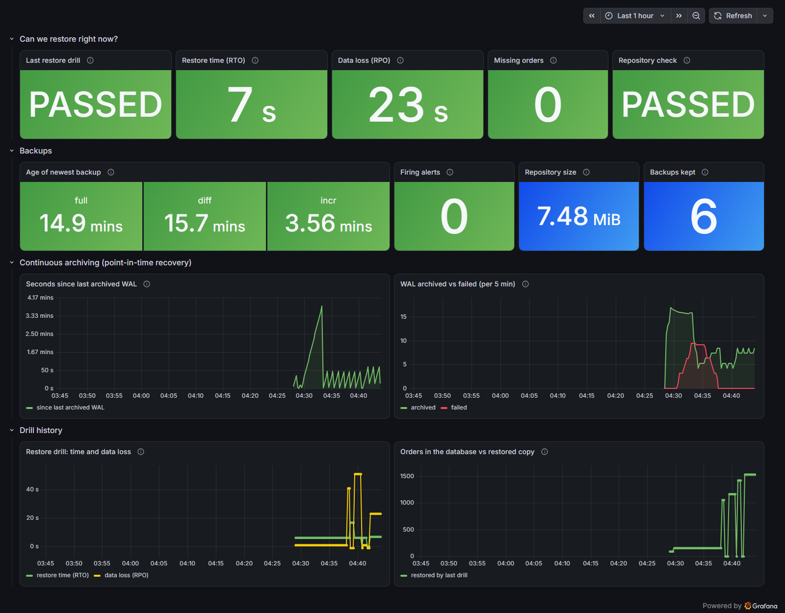

# PostgreSQL Backups You Can Trust: Restore Drills & Point-in-Time Recovery

Most teams *have* backups. Far fewer know that their backups **restore**. This project runs PostgreSQL with production-grade continuous backups:
- **Archiving:** pgBackRest sends every change to encrypted S3 storage within a minute.
- **Restore drills:** every day it restores the latest backup into a scratch copy, checks that copy against the live database, and publishes the result.
- **Monitoring:** if a backup, the WAL archive, a verification or a drill fails, an alert says so.
- **Point-in-time recovery:** one command undoes an accident like `DROP TABLE` to the second before it happened.




> 📚 **New to DevOps or databases? Start with the [study guide](study/README.md)** (also a single **[PDF](study/study-guide.pdf)**). It explains PostgreSQL, WAL and point-in-time recovery, pgBackRest, S3, restore drills, Docker Compose, Prometheus and Grafana from zero, with hands-on labs and interview questions.

**Measured in the lab** (details: [docs/test-results.md](docs/test-results.md)):

| What was tested | Result |
|---|---|
| Empty machine → running stack with first full backup | **68 s** |
| Daily restore drill (restore + start + compare + amcheck) | **6 s**, 0 missing orders, no corruption |
| `DROP TABLE orders` → point-in-time recovery | back in service in **10 s**, all **123/123** orders before the accident restored, 0 after |
| Object storage down for ~3.5 min | database kept working, alert after 198 s, archive caught up 35 s after recovery, **0 orders lost** |
| Database volume deleted (disk lost) | rebuilt from S3 in **16 s**, every archived order back |
| One backup file silently damaged (bit rot) | detected by `verify` (checksum invalid: 1), drill failed, 2 alerts fired |
| Wrong/lost encryption passphrase | nothing restorable, drill failed + alert |
| Database host tries to reach the backup storage | impossible (separate network) |
| Raw backup files searched for order data | 0 matches (encrypted at rest) |

---

## 1. Problem statement

A backup that has never been restored is a hope, not a backup. Teams often find out during an incident that:
- the backup job had been failing for weeks
- the files are incomplete or corrupt
- the encryption key is lost
- a restore takes hours instead of minutes

A nightly dump also loses everything written since the last run.

## 2. Pain point

- **Silent failures:** cron jobs fail quietly, and nobody looks at backup logs until they are needed.
- **No point-in-time recovery:** a nightly `pg_dump` can't undo a `DELETE` made at 14:05. You lose up to a day of data, or keep the mistake.
- **Unknown RTO/RPO:** "How long would a restore take, and how much data would we lose?" usually has no measured answer.
- **Backups next to the database:** if the database server is compromised (ransomware), its backups go with it.
- **Unverified storage:** bit rot or a damaged object in S3 is only discovered on the day of the restore.

## 3. Objectives

1. Continuous backups: WAL archived at least every **60 s** (RPO ≤ ~1 min), plus full/differential/incremental backups.
2. **Prove restorability every day** with an automatic restore drill that measures RTO and RPO and checks for missing rows and corruption.
3. One-command **point-in-time recovery** of the live database.
4. **Defence in depth:**
   - encryption at rest
   - mutual TLS between hosts
   - credentials only on the backup host
   - storage unreachable from the database
5. Alerts for every way backups can silently stop working, each with a unit test.
6. Runs anywhere Docker runs; switches to AWS S3 (or any S3) by changing an endpoint.

## 4. Architecture

Full design and decision log: [docs/architecture.md](docs/architecture.md).

| Component | Role |
|---|---|
| `db` | PostgreSQL 18 + pgBackRest TLS server. Archives WAL (async queue) through the backup host. Holds **no** S3 credentials or passphrase. |
| `backup` | Dedicated backup host: pgBackRest repository in S3, supercronic schedule. It runs backups (full weekly, diff daily, incr hourly), `verify` (daily) and the **restore drill** (daily), and publishes metrics. |
| `s3` | S3-compatible object storage (SeaweedFS 4.48, HTTPS only). Replace it with AWS S3 in production. |
| `app` | A small shop application writing orders continuously (makes data loss measurable). |
| `pushgateway`, `postgres-exporter`, `prometheus`, `grafana` | Metrics, 11 alert rules, dashboard. |

**Networks:**
- **data:** db, app, backup and the exporter.
- **storage:** s3 and backup.
- **monitoring:** Prometheus, Grafana, Pushgateway, the exporter and backup.

The database and the application **cannot reach** the storage.

## 5. Technologies

| Tool | Version | Why it is here |
|---|---|---|
| PostgreSQL | 18.6 | the database being protected |
| pgBackRest | 2.59.2 (pinned) | parallel, encrypted, block-incremental backups, async WAL archiving, delta restore, `verify` |
| SeaweedFS | 4.48 | S3-compatible storage for the lab (MinIO stopped publishing images in 2025 and was archived in 2026) |
| supercronic | 0.2.49 (SHA-256 pinned) | cron built for containers: logs to stdout, clean shutdown |
| Prometheus + Pushgateway + postgres_exporter | 3.15.0 / 1.11.3 / 0.20.1 | batch-job results, WAL-archiver state, alerting |
| Grafana | 13.2.3 | dashboard provisioned as code |
| Docker Compose | v2 | the whole stack, secrets, isolated networks |
| GitHub Actions | — | static checks, image scan (Trivy), full end-to-end test |
| Python, Bash | 3.13 / 5 | metrics exporter (unit-tested), operational scripts (ShellCheck) |

## 6. Repository structure

```
image/            Dockerfile (PostgreSQL 18 + pgBackRest + supercronic), crontab, initdb/
  bin/            entrypoint (roles: db, backup, app, restore) · run-backup · run-verify
                  restore-drill · backup-metrics · init-stanza · pushmetrics · loadgen
deploy/           compose.yaml · prometheus/ (config + 11 alert rules) · grafana/ (provisioning + dashboard)
scripts/          setup (secrets + certs) · up · down · backup · drill · verify · status · pitr · recover-lost-db · e2e · lint
tests/            pytest for the metrics exporter (real pgBackRest JSON fixture) · promtool tests for every alert
docs/             architecture · runbook · troubleshooting · test-results
study/            beginner study guide (+ PDF)
linkedin/         post, carousel, project image
```

## 7. Prerequisites

- **Docker with Compose v2.**
- **Bash and OpenSSL:** Git Bash on Windows works.
- **Disk and memory:** about 2 GB of disk and 2 GB of RAM.

## 8. Quick start

```bash
scripts/up.sh                 # creates secrets + certificates, starts everything, waits for the first full backup (~1 min)
scripts/status.sh             # what is in the repository + result of the last drill
scripts/drill.sh              # run a restore drill now
scripts/backup.sh incr        # take a backup now (full | diff | incr)
scripts/pitr.sh "2026-10-03 14:05:00+00"   # point-in-time recovery of the live database
scripts/recover-lost-db.sh    # database data lost: rebuild it from the backups
scripts/down.sh               # stop (data kept); --purge deletes everything
```

- **Grafana:** http://localhost:3000. Anonymous viewing is on; the admin password is in `.secrets/grafana_admin_password`.
- **Prometheus:** http://localhost:9090
- **Full proof from scratch (about 15 minutes):** `scripts/e2e.sh`, which writes `reports/e2e-results.md`.

## 9. Configuration

| Setting | Where | Default |
|---|---|---|
| WAL archive interval (RPO bound) | `deploy/compose.yaml` → `archive_timeout` | 60 s |
| Backup schedule | `image/crontab` | full Sun 01:00, diff Mon–Sat 01:00, incr hourly :30 (UTC) |
| Verify / drill schedule | `image/crontab` | 03:00 / 04:00 UTC |
| Full backups kept | `RETENTION_FULL` env on `backup` | 2 |
| Parallel processes | `PROCESS_MAX` | 2 |
| S3 endpoint / bucket / region / port | `S3_ENDPOINT`, `S3_BUCKET`, `S3_REGION`, `S3_PORT`, `S3_URI_STYLE` | `s3`, `pgbackrest`, `us-east-1`, 8443, `path` |
| Alert thresholds (RTO 30 min, RPO 5 min, backup age 2 h) | `deploy/prometheus/rules/backups.yml` | |

**AWS S3 in production:**
- **Endpoint:** set `S3_ENDPOINT=s3.<region>.amazonaws.com`, `S3_PORT=443`, `S3_URI_STYLE=host` and `S3_REGION`.
- **Credentials:** put the IAM user's keys in `.secrets/`, or switch pgBackRest to `repo1-s3-key-type=auto` for an instance role.
- **Storage:** remove the `s3` service.
- **Bucket protection:** enable Object Lock or versioning on the bucket against deletion.

## 10. Testing

| Layer | Command | What it proves |
|---|---|---|
| Static | `scripts/lint.sh` | ShellCheck (all scripts), yamllint, ruff, 7 pytest tests, hadolint, promtool config + 6 alert test groups, compose and dashboard validity |
| Image | CI job `image` | Trivy: no fixable HIGH/CRITICAL vulnerabilities |
| End-to-end | `scripts/e2e.sh` | 11 sections: backups, drill, verify, PITR after DROP TABLE, storage outage, bit rot, lost key, lost database volume, network isolation, encryption at rest, monitoring |

The e2e test runs in GitHub Actions on every push and weekly ([workflow](.github/workflows/ci.yaml)).

## 11. Results (measured)

See [docs/test-results.md](docs/test-results.md) for every number with its context.

## 12. Monitoring



**The dashboard answers "can we restore right now?" first:**
- the last drill's result, measured restore time (RTO), data loss (RPO) and missing orders
- the repository verification result
- then the age of each backup type, firing alerts, repository size, WAL archiving and drill history

**Alert rules** ([deploy/prometheus/rules/backups.yml](deploy/prometheus/rules/backups.yml)), each with a promtool test:
- **WAL archive:** `WalArchivingFailing`, `WalArchivingStale`
- **Backups:** `BackupFailed`, `BackupTooOld`, `FullBackupTooOld`, `RepositoryUnreadable`
- **Repository integrity:** `BackupVerifyFailed`
- **Drills:** `RestoreDrillFailed`, `RestoreDrillMissing`, `RestoreTooSlow`, `RestoreDataLossHigh`

## 13. Security

- **Encryption at rest:** AES-256-CBC on every backup and WAL file. The e2e test finds no readable order data in raw objects.
- **Separation of duties:** the database host has no S3 credentials and no passphrase, and it is on a network that cannot reach storage.
- **Mutual TLS** between the database and backup hosts, using a private CA. The CA key is kept out of every container.
- **Secrets:**
  - They are generated per installation into `.secrets/` (git-ignored) and mounted as Docker secrets.
  - Inside containers they are copied to files only the `postgres` user can read.
- **Pinned and verified tools:** pgBackRest is pinned to an exact version, supercronic is SHA-256 verified, and the image is scanned by Trivy in CI (0 fixable HIGH/CRITICAL).
- **No vulnerable binary from the base image:** the base image's `gosu` binary (an old Go runtime with 1 CRITICAL and 21 HIGH CVEs) is replaced by a `setpriv` shim.
- **The lost-key scenario is tested.** Keep the passphrase in a password manager or vault outside the server.

## 14. Troubleshooting

[docs/troubleshooting.md](docs/troubleshooting.md) covers every problem found while building this:
- the MinIO situation and the S3 health check
- an unclean shutdown that blocked restores
- a verify run that hung on a truncated object
- certificate naming for the restore role
- alert-rule bugs caught by promtool
- Windows path issues

## 15. Failure scenarios

| Scenario | Expected | Measured |
|---|---|---|
| Accidental `DROP TABLE` | restore to the second before | 123/123 orders back, 0 later rows, 10 s |
| Object storage outage | DB keeps working, alert, no data loss | alert after 198 s, catch-up 35 s, 0 orders lost |
| Bit rot in a backup file | detected before it is needed | verify + drill failed, 2 alerts |
| Lost encryption key | nothing restorable, alert | drill failed, `RestoreDrillFailed` fired |
| Backup scheduled during the outage | fails visibly | `BackupFailed` fired; next backup cleared it |
| Database volume lost | rebuild from backups | 16 s, all archived orders back |
| Empty database started by mistake | repository must stay safe | its WAL rejected: "system-id do not match" |

## 16. Operations

The [runbook](docs/runbook.md) covers:
- daily checks
- what to do for each alert
- point-in-time recovery step by step
- restoring onto a new server
- rotating secrets
- moving to AWS S3
- upgrading PostgreSQL and pgBackRest

## 17. Cleanup

```bash
scripts/down.sh --purge     # removes containers, networks and ALL data volumes (database + backups)
```

## 18. Limitations

- **Single database server:** high availability (replicas, failover) is a separate concern.
- **The lab's object store is a single SeaweedFS container:** production needs durable, ideally off-site and versioned or immutable storage.
- **Drill size:** the drill restores onto the backup host. For very large databases, run it on a dedicated drill server with enough disk.
- **Pushgateway:** it keeps the last value per job, which suits batch results but isn't an event history.

## 19. Future improvements

- A second repository in another region (pgBackRest `repo2`) for 3-2-1 backups.
- S3 Object Lock (immutability) and lifecycle rules.
- Alertmanager routing (Slack/e-mail) and a weekly restore of a *full* production-size copy.
- A Kubernetes version using CloudNativePG with the same drill.

## 20. Learning resources

- **This project's [study guide](study/README.md) / [PDF](study/study-guide.pdf).**
- **pgBackRest:** [user guide](https://pgbackrest.org/user-guide.html), [configuration reference](https://pgbackrest.org/configuration.html).
- **PostgreSQL:** [continuous archiving and PITR](https://www.postgresql.org/docs/18/continuous-archiving.html), [amcheck](https://www.postgresql.org/docs/18/amcheck.html).
- **Monitoring:** [Prometheus Pushgateway: when to use it](https://prometheus.io/docs/practices/pushing/).

## 21. Skills demonstrated

- **Database reliability:** WAL archiving, PITR, timelines, RPO/RTO measurement, automated restore verification, amcheck.
- **Backup engineering:**
  - pgBackRest repo-host architecture, mutual TLS, encryption
  - block incremental, retention, verify
- **Security:** network segmentation, least privilege for credentials, encryption at rest, private CA.
- **Observability:** Pushgateway for batch jobs, postgres_exporter, alert design with promtool unit tests, Grafana as code.
- **Testing and CI:**
  - an end-to-end chaos-style test suite: outage, bit rot, lost key, accident
  - Trivy and hadolint, ShellCheck, pytest

---
**Author:** Sufyan Ahmad · DevOps Engineer · [Portfolio](https://sufyanahmadkamboh.github.io/) · [LinkedIn](https://linkedin.com/in/sufyanahmadkamboh)
